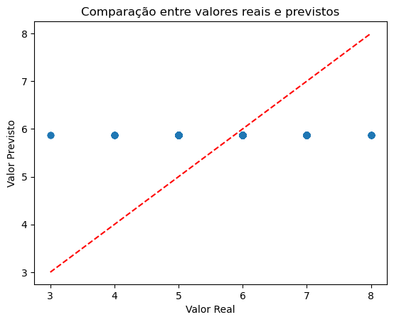
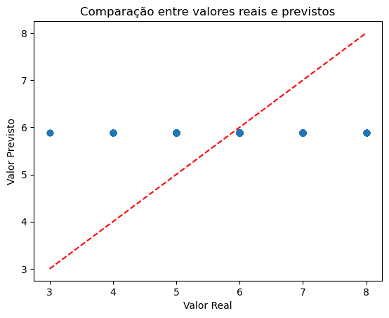

# Projeto 01 - Analisando Vinhos


## Artigo referência

[artigo base do projeto](https://www.semanticscholar.org/paper/Modeling-wine-preferences-by-data-mining-from-Cortez-Cerdeira/bf15a0ccc14ac1deb5cea570c870389c16be019c)

## Descrição breve:

O artigo apresenta uma abordagem integrada de data mining para prever as preferências sensoriais de vinhos com base em testes físico-químicos realizados durante o processo de certificação. Para isso, os autores comparam três técnicas: regressão múltipla, redes neurais (MLP) e máquinas de vetor de suporte (SVM), utilizando dois grandes conjuntos de dados – um com 4898 amostras de vinho branco e outro com 1599 amostras de vinho tinto.

A metodologia proposta combina a seleção de variáveis e de modelos de forma simultânea. A seleção de variáveis é orientada por uma análise de sensibilidade que quantifica a importância de cada parâmetro físico-químico, permitindo eliminar aquelas menos relevantes. Para a seleção do modelo, o estudo utiliza uma busca por parcimônia dos hiperparâmetros (como o número de neurônios na camada oculta das redes neurais e o parâmetro γ no SVM). 

Os modelos são avaliados por meio do desvio absoluto médio (MAD), acurácia em diferentes níveis de tolerância e estatísticas como o Kappa, utilizando procedimentos de validação cruzada.

Os resultados demonstraram que, embora as redes neurais apresentem desempenhos semelhantes à regressão múltipla para o vinho tinto, a SVM obteve as melhores performances, especialmente no caso do vinho branco, evidenciando maior acurácia preditiva. Além disso, a análise de sensibilidade revelou insights interessantes sobre a importância de variáveis como o teor alcoólico e os níveis de sulfatos, que estão de acordo com conhecimentos oenológicos.

O estudo destaca o potencial dos métodos de data mining para melhorar a avaliação sensorial dos vinhos, contribuindo para processos de controle de qualidade, suporte à decisão e estratégias de marketing no setor vitivinícola.

### **Objetivo e Relevância**

O artigo foca na avaliação da qualidade do vinho por meio de técnicas de mineração de dados, oferecendo suporte tanto para a produção quanto para a comercialização. Seu principal objetivo é identificar os fatores físico-químicos e sensoriais mais relevantes que influenciam a qualidade do vinho. Com esses insights, é possível otimizar o processo de fabricação e também identificar vinhos premium, permitindo ajustes na precificação.

**Processo de Certificação do Vinho**

A certificação envolve dois tipos principais de análises:

1. **Testes Físico-Químicos (laboratoriais):**
    
    - Parâmetros como densidade, pH, teor alcoólico, entre outros, são medidos para garantir a qualidade e a segurança do produto.
2. **Teste Sensorial:**
    
    - Avaliação realizada por especialistas, que aplicam sua expertise humana para julgar atributos sensoriais do vinho.

### **Contexto do Estudo**

O estudo concentra-se na produção de _Vinho Verde_, um segmento que corresponde a aproximadamente 15% da produção de vinhos portugueses. São analisadas as duas variantes mais comuns: vinho branco e vinho tinto. Os dados foram coletados entre maio de 2004 e fevereiro de 2007, tendo sido testados e certificados pela CVRVV.

### **Abordagem para Mineração de Dados e Avaliação**

- **Função Custo:**  
    Utilizou-se o Desvio Absoluto Médio (MAD) para mensurar a precisão das previsões dos modelos.
    
- **Validação dos Modelos:**  
    Foram aplicadas técnicas de validação, como o holdout (dividindo 2/3 dos dados para treinamento e 1/3 para teste) e a validação cruzada (k-fold com k=5 e 20 iterações), permitindo uma avaliação robusta dos modelos.  
    Além disso, os modelos foram avaliados com base na acurácia e em diferentes níveis de tolerância de erro (T = 0.25, 0.5 e 1.0).
    

### **Métodos de Mineração de Dados**

#### Redes Neurais (MLP)

Para a tarefa de regressão, foi utilizada uma rede neural do tipo Multilayer Perceptron (MLP) com a seguinte configuração:

- **Camada Oculta:**
    
    - Uma única camada oculta composta por um número variável de neurônios (H).
    - Função de ativação logística.
    - Observa-se que H = 0 corresponde a um modelo de regressão linear, e que um valor muito elevado de H pode levar ao overfitting.
- **Camada de Saída:**
    
    - Um único neurônio com função de ativação linear.

Uma sugestão para aprimorar a avaliação do modelo seria experimentar arquiteturas com múltiplas camadas ocultas. Por exemplo, considerando as 11 características disponíveis, poderia iniciar com 20 neurônios (2 vezes o número de características) na primeira camada e, em seguida, testar incrementos no número de camadas (variando de 1 a 10) enquanto se ajusta o número de neurônios em cada camada.

### Seleção de Variáveis e Modelos

O artigo enfatiza a importância da seleção de variáveis para reduzir a complexidade dos modelos e melhorar a performance preditiva. Entre os métodos testados, a Máquina de Vetores de Suporte (SVM) apresentou os melhores resultados, demonstrando sua eficácia na tarefa de regressão aplicada à previsão das preferências sensoriais do vinho.

---

Em resumo, a abordagem proposta no artigo integra técnicas de análise físico-química e avaliação sensorial, combinadas com métodos avançados de mineração de dados, para oferecer um suporte robusto na produção e comercialização do vinho. Essa integração não só melhora a compreensão dos fatores que determinam a qualidade do vinho, mas também contribui para a identificação de produtos premium e para estratégias de precificação mais eficientes.


## Objetivos do projeto 


Para o projeto devem ser empregadas as seguintes técnicas:

- Análise exploratória de dados;
- Pré-Processamento dos dados;
- técnicas clássicas de filtragem; e
- balanceamento de classes.

Vale ressaltar que este é um problema de predição, pois o objetivo do artigo é prever a nota (0 a 10), mesmo que pareça um problema de classificação.
## 1.1 Desenvolvimento

### Baixar a base de dados:

```
from ucimlrepo import fetch_ucirepo 
  
# fetch dataset 
wine_quality = fetch_ucirepo(id=186) 
  
# data (as pandas dataframes) 
X = wine_quality.data.features 
y = wine_quality.data.targets 
  
# metadata 
print(wine_quality.metadata) 
  
# variable information 
print(wine_quality.variables)
```


### Visualizar a dimensão da matriz de dados e do vetor de rótulos:

```
X.head()

```

### Feature engineering 

Realizar uma análise criteriosa dos dados de base de dados. Pontos que devem ser considerados.
	1. Base de dados é consistente?
	2. Há dados faltantes?
	3. Há dados não numéricos?
	4. A Base da dados é balanceada? (considerar as classes vinho tinto e branco)


```
X.describe()                # Estatísticas descritivas
X[X.isna().any(axis=1)]     # Linhas com valores faltantes
X.empty                     # Verifica se o DataFrame está vazio
X.shape                     # Dimensões do DataFrame
X.ndim                      # Número de dimensões
X.dtypes                    # Tipos dos dados
X.info                      # Informações detalhadas
X.value_counts()            # Contagem de ocorrências


```

**Características dos Dados:**

- **X (Features):**  
  O conjunto de dados apresenta 11 características dos vinhos, onde todas as variáveis possuem o mesmo número de amostras, o que indica que não há necessidade de balancear o conjunto de dados do ponto de vista de registros.

- **y (Target):**  
  As notas dos vinhos variam de 3 a 9.

**Estatísticas Descritivas:**

- **Contagem (`count`):**  
  Todas as variáveis apresentam a mesma quantidade de amostras, confirmando a consistência na coleta dos dados.

- **Desvio Padrão (`std`):**  
  O desvio padrão, relativamente baixo em comparação com a média de cada característica, sugere que os dados estão concentrados próximos à média, o que pode indicar uma distribuição mais homogênea.

- **Distribuição dos Valores (`value_counts` para y):**  
  Apesar da distribuição normal aparente, observa-se que há poucas amostras com avaliações menores que 5 e superiores a 7. Essa estratificação pode afetar a precisão dos modelos, sobretudo na predição de extremos (máximas e mínimas avaliações).

- **Valores Máximos (`max`):**  
  Em diversas características, os valores máximos estão significativamente afastados da média do 75º percentil, sugerindo a presença de outliers ou vinhos com composições atípicas. É importante investigar se esses valores extremos possuem alguma correlação com a qualidade dos vinhos.

- **Dimensões (`shape` e `ndim`):**  
  O conjunto de dados possui uma dimensão de 6497 amostras por 11 características (6497, 11) e é bidimensional (2D).

- **Tipos de Dados (`dtypes`):**  
  Todas as variáveis são do tipo `float64`, o que facilita a análise estatística e modelagem.

- **Valores Ausentes (`isna` e `empty`):**  
  Não foram identificados valores `NaN` ou colunas vazias, indicando que o conjunto de dados está completo e bem estruturado para as análises subsequentes.

4. Apresente uma análise estatística dos dados que embase quais variáveis de entrada são mais relevantes se quisermos classificar o vinho pelo tipo (tinto vc branco). 
	1. justifique.


```
sns.heatmap(Z.iloc[:, :-1].corr(), cmap='coolwarm', annot=True)
```


analisando o conjunto de dados como um todo temos uma correlação maior das características `alcohol` e `density` com relação a avaliação de qualidade.


```
W = Z.copy()

W["color"] = W["color"].map({"red": 0, "white": 1})
```


```
sns.heatmap(W.corr(), cmap='coolwarm', annot=True)
```


```
corr_sort.iloc[:-1].plot(kind="barh")
```

O gráfico indica as características com maior correlação com o tipo de vinho são :
	- `total_sulfur_dioxide` 0.700357 
	- `volatile_acidity` -0.653036  
	- `chlorides` -0.512678 


5. Escolha duas das variáveis de entrada e faca um gráfico de dispersão para visualizar a distribuição dos dados de cada classe de vinho.
	1. justifique sua escolha


```
sns.pairplot(Z[["total_sulfur_dioxide", "volatile_acidity", "chlorides", "sulphates", "color"]], hue="color")
```


```

g = sns.jointplot(data=Z, x='total_sulfur_dioxide', y='volatile_acidity',
                  kind='scatter', hue='color', alpha=0.2)

sns.kdeplot(data=Z, x='total_sulfur_dioxide', y='volatile_acidity',
            hue='color', ax=g.ax_joint, alpha=1, linewidths=1)
```


Este é o gráfico em que o centro conjuntos de dados estão mais distantes e com menor sobreposição em sua divisão.


6. Considerando agora a variável de qualidade do vinho, avalie como é a prevalência nas duas classes para os vinhos mais bem avaliados (nota>7) e para os menos avaliados (nota < 3) 


```
vinhos_bem = Z[Z["quality"] > 7]
vinhos_mal = Z[Z["quality"] <= 3]


prevalencia_bem = vinhos_bem["color"].value_counts(normalize=True)
print("Prevalência em vinhos bem avaliados:\n", prevalencia_bem)

prevalencia_mal = vinhos_mal["color"].value_counts(normalize=True)
print("Prevalência em vinhos mal avaliados:\n", prevalencia_mal)

>>>Prevalência em vinhos bem avaliados: color white 0.909091 red 0.090909 
>>>Prevalência em vinhos mal avaliados: color white 0.666667 red 0.333333 Name: proportion, dtype: float64
```


```
sample_red = Z[Z["color"] == "red"]
sample_white = Z[Z["color"] == "white"]

print(f'''total de amostras:{Z.shape[0]}.\n
      total de amostras vinho tinto: {sample_red.shape[0]}, {round(sample_red.shape[0] * 100/Z.shape[0], 2)}%\n
      total de amostras vinho branco: {sample_white.shape[0]}, {round(sample_white.shape[0] * 100/Z.shape[0], 2)}%''')

>>>total de amostras:6497. 
>>>total de amostras vinho tinto: 1599, 24.61% 
>>>total de amostras vinho branco: 4898, 75.38864091118978%
```

As amostras de vinho tinto são de 24,61% enquanto que as de vinho branco são de 75,38%, demonstrando que o conjunto de dados esta desbalanceado o que dificulta avaliar se de fato os vinhos brancos são realmente melhores em qualidade, por receberem notas maiores, em relação aos vinhos tinto.


```
sample_red["quality"].value_counts() / sample_red.shape[0]
sample_white["quality"].value_counts() / sample_white.shape[0]
```


|           | tinto   | branco  |
| --------- | ------- | ------- |
| 9         | 0       | 0.001   |
| 8         | 0.011   | 0.036   |
| 7         | 0.124   | 0.180   |
| 6         | 0.399   | 0.449   |
| 5         | 0.426   | 0.297   |
| 4         | 0.033   | 0.033   |
| 3         | 0.006   | 0.004   |
| total     | 1599    | 4898    |
| proporção | 24.61.% | 75.39.% |

Ao fazer uma analise de proporcionalidade, é observável que :

**Bem avaliado( nota >= 7):** 
	Tinto: 13.5%
	Branco: 21.7%
**Mal avaliado( nota <= 4):**
	Tinto: 3.9%
	Branco: 3.7%
**Avaliação média:**
	Tinto: 82.5%
	Branco: 74.6%


Para obter uma avaliação mais assertiva tanto em relação a qual característica é mais relevante para classificar um vinho quanto para predição de qualidade é de suma importância que os dados estejam melhor estratificados, com uma quantidade maior de amostras de vinho tinto e melhor balanceado, em relação as notas de qualidade.


## Testando modelos de redes neurais


```
optimizer = tf.keras.optimizers.SGD(learning_rate=1e-3)
model.compile(loss="mse", optimizer=optimizer, metrics=["mae"])
```

```
history = model.fit(X_train, y_train, epochs=40,
                    validation_data=(X_valid, y_valid))
```


### 3 camadas, 20n

```
model = tf.keras.Sequential([
    tf.keras.layers.Dense(20, activation="relu"),
    tf.keras.layers.Dense(20, activation="relu"),
    tf.keras.layers.Dense(20, activation="relu"),
    tf.keras.layers.Dense(1)
])
```


Model: "sequential_2"

┏━━━━━━━━━━━━━━━━━━━━━━━━━━━━━━━━━┳━━━━━━━━━━━━━━━━━━━━━━━━┳━━━━━━━━━━━━━━━┓
┃ Layer (type)                    ┃ Output Shape           ┃       Param # ┃
┡━━━━━━━━━━━━━━━━━━━━━━━━━━━━━━━━━╇━━━━━━━━━━━━━━━━━━━━━━━━╇━━━━━━━━━━━━━━━┩
│ dense_6 (Dense)                 │ (None, 20)             │            80 │
├─────────────────────────────────┼────────────────────────┼───────────────┤
│ dense_7 (Dense)                 │ (None, 20)             │           420 │
├─────────────────────────────────┼────────────────────────┼───────────────┤
│ dense_8 (Dense)                 │ (None, 20)             │           420 │
├─────────────────────────────────┼────────────────────────┼───────────────┤
│ dense_9 (Dense)                 │ (None, 1)              │            21 │
└─────────────────────────────────┴────────────────────────┴───────────────┘

 Total params: 943 (3.69 KB)

 Trainable params: 941 (3.68 KB)

 Non-trainable params: 0 (0.00 B)

 Optimizer params: 2 (12.00 B)


O parâmetro `epoch` está exagerado.

MAE: 0.6807 
MSE: 0.8020 
RMSE: 0.8955 
R²: -0.0002

### 3 camadas, 20n, 10n, 5n


```
model = tf.keras.Sequential([

    tf.keras.layers.Dense(20, activation="relu"),

    tf.keras.layers.Dense(10, activation="relu"),

    tf.keras.layers.Dense(5, activation="relu"),

    tf.keras.layers.Dense(1)

])
```


```
history = model.fit(X_train, y_train, epochs=20,

                    validation_data=(X_valid, y_valid))
```
_epoch=20_

Model: "sequential_3"

┏━━━━━━━━━━━━━━━━━━━━━━━━━━━━━━━━━┳━━━━━━━━━━━━━━━━━━━━━━━━┳━━━━━━━━━━━━━━━┓
┃ Layer (type)                    ┃ Output Shape           ┃       Param # ┃
┡━━━━━━━━━━━━━━━━━━━━━━━━━━━━━━━━━╇━━━━━━━━━━━━━━━━━━━━━━━━╇━━━━━━━━━━━━━━━┩
│ dense_10 (Dense)                │ (None, 20)             │            80 │
├─────────────────────────────────┼────────────────────────┼───────────────┤
│ dense_11 (Dense)                │ (None, 10)             │           210 │
├─────────────────────────────────┼────────────────────────┼───────────────┤
│ dense_12 (Dense)                │ (None, 5)              │            55 │
├─────────────────────────────────┼────────────────────────┼───────────────┤
│ dense_13 (Dense)                │ (None, 1)              │             6 │
└─────────────────────────────────┴────────────────────────┴───────────────┘

 Total params: 353 (1.38 KB)

 Trainable params: 351 (1.37 KB)

 Non-trainable params: 0 (0.00 B)

 Optimizer params: 2 (12.00 B)


MAE: 0.6827 
MSE: 0.8019 
RMSE: 0.8955 
R²: -0.0001





### 1 camada, 8n


```
model = tf.keras.Sequential([

    tf.keras.layers.Dense(8, activation="relu"),

    tf.keras.layers.Dense(1)

])
```


```
history = model.fit(X_train, y_train, epochs=10,

                    validation_data=(X_valid, y_valid))
```

Model: "sequential_4"

┏━━━━━━━━━━━━━━━━━━━━━━━━━━━━━━━━━┳━━━━━━━━━━━━━━━━━━━━━━━━┳━━━━━━━━━━━━━━━┓
┃ Layer (type)                    ┃ Output Shape           ┃       Param # ┃
┡━━━━━━━━━━━━━━━━━━━━━━━━━━━━━━━━━╇━━━━━━━━━━━━━━━━━━━━━━━━╇━━━━━━━━━━━━━━━┩
│ dense_14 (Dense)                │ (None, 8)              │            32 │
├─────────────────────────────────┼────────────────────────┼───────────────┤
│ dense_15 (Dense)                │ (None, 1)              │             9 │
└─────────────────────────────────┴────────────────────────┴───────────────┘

 Total params: 43 (176.00 B)

 Trainable params: 41 (164.00 B)

 Non-trainable params: 0 (0.00 B)

 Optimizer params: 2 (12.00 B)


Desta vez o modelo não conseguiu completar o treinamento, logo é preciso aumentar o número de `epoch`

MAE: 0.8675 
MSE: 1.1147 
MSE: 
1.0558 
R²: -0.3902





```
X_red = sample_red[["total_sulfur_dioxide","volatile_acidity","chlorides"]].values
y_red = sample_red["quality"].values

```


Ao que tudo indica utilizar poucos dados, somente as características mais relevantes não esta sendo o suficiente para o modelo se ajustar. 
valor que o modelo teve maior assertividade foi entorno da nota 6, justamente a que tem maior quantidade de amostras. 

### Dataset inteiro


MAE: 0.6816 
MSE: 0.8019 
RMSE: 0.8955 
R²: -0.0001

Mesmo com o conjunto da dados inteiro o resultado não foi muito diferente, o número de amostras desbalanceadas faz com o que modelo tenda a prever a qualidade entre 5 a 7 para ter maior assertividade.